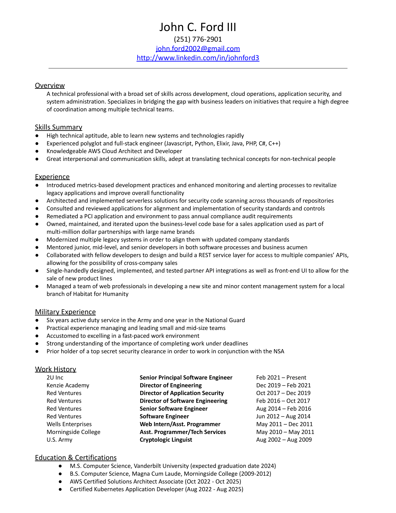

# Vanderbilt Graduate Portfolio - John C. Ford III

## **SUMMARY DATA**

### **Personal Information**

* **Name:** John Charles Ford III
* **Program:** M.S. Computer Science
* **Program Start:** Fall 2022 - Full Time
* **Graduation Date:** May 2024

### **Courses & Grades**
| Course Title                           | Semester Taken | Instructor(s)            | Grade    |
| -------------------------------------- | -------------- | ------------------------ | -------- |
| CS5253 Parallel Func. Programming      | Fall ‘23       | Douglas C. Schmidt       | A        |
| CS5254 Conc. Obj-Oriented Programming  | Summer ‘23     | Douglas C. Schmidt       | A        |
| CS5260 Artificial Intelligence         | Spring ‘23     | Ronald William Hedgecock | A        |
| CS5262 Foundations of Machine Learning | Fall ‘22       | Peng Zhang               | A        |
| CS5279 Software Eng. Project           | Spring ‘24     | Yu Sun                   | Enrolled |
| CS5288 Web System Architecture         | Summer ‘23     | Edward Klein             | A        |
| CS6381 Distributed Systems             | Spring ‘23     | Aniruddha S. Gokhale     | A        |
| CS8395 Quantum Computing               | Fall ‘22       | Charles Easttom          | A+       |
| CS8395 Digital Forensics               | Fall ‘23       | Charles Easttom          | A        |
| CS8395 Microservices                   | Spring ‘24     | Douglas C. Schmidt       | Enrolled |

### Professional Goals & Achievements

When I applied to Vanderbilt, I was bringing 10+ years of software industry experience with me. I chose Vanderbilt’s program for its diverse selection of course offerings. I wanted to broaden my exposure to other disciplines within computer science, and I also wanted to strengthen my conceptual understanding of more advanced topics. Distributed systems, concurrency, and parallelism have increasingly been featured in many of the technical challenges within my career.

### Academic Achievements

During my studies at Vanderbilt, I successfully maintained a full course load while also working full-time as a Senior Principal Software Engineer. At times, this meant spending all day on the computer for my day job and immediately switching into student-mode from the moment work finished until it was time for bed. Finishing the program is the culmination of all the hard work, and the results were worth it. I exhibited a high level of academic dedication and excellence, maintaining a 4.0 GPA throughout the program. 

## **CURRICULUM VITAE**

[Latest Curriculum Vitae](./artifacts/curriculum-vitae/curriculum-vitae.pdf)

## **KNOWLEDGE & MASTERY OF COMPUTER SCIENCE CONCEPTS**
### Artifact - Apply Computer Science Concepts

As part of Vanderbilt’s CS-5262 Foundations of Machine Learning, I was able to combine a personal interest in local real estate with newly learned skills in analyzing data and creating ML models. Prior to taking this course, I had only ever consumed the outputs of models created by teams of analysts and data scientists. Learning about the work behind creating models and evaluating them offered a lot of insights into the different challenges facing my colleagues. 
  
**[Real Estate Sales Data Exploration - Arapahoe County, Colorado (October 2022)](./artifacts/knowledge-and-mastery/apply-cs-concepts/real-estate-exploration.pdf)**

### Artifact - Contribute to Software Artifacts

As part of Vanderbilt’s CS-5260 Artificial Intelligence, I was tasked with building an artificial agent, something I had never attempted previously. The project overview set the expectation:

“The CS 5260 programming project is somewhat open-ended, allowing you to participate in the specification process, including design, implementation, and evaluation. The project requires integration of knowledge and skills learned in earlier CS courses and professional experiences, and you should ideally incorporate knowledge from other disciplines and areas of interest to you. 

The goal of the project is to build a multi-method AI agent that plans and models trading and development (e.g., farming, manufacturing) decisions for a set of virtual countries, with each country possessing virtual resources and incentives for cooperating and competing with other countries. The project is split into two parts. In Part 1, you will create a well-defined backbone for an AI agent (a.k.a. virtual country) that simulates potential actions in a simulated world; however, the design specification for Part 1 still has gaps that you must define. In Part 2, you will build additional functionality into your AI agent from Part 1 as you see fit (e.g., for learning, game play, game definition, modeling war, reasoning under uncertainty, etc.).”

With this project being so open-ended, it offered many opportunities to engage in discussion, sharing, and collaboration with both the professor and the class at large. At the outset of the project, I shared some of my early ideas for small utility code implementations and more complex future abstractions.

- [Early Project Ideas - Shared to Piazza](./artifacts/knowledge-and-mastery/contribute-artifacts/01-CS5260-early-project-ideas.pdf)
- [Simple File Reader - Code Snippet Shared to Piazza](./artifacts/knowledge-and-mastery/contribute-artifacts/02-CS5260-file-reading.pdf)
- [Transform Template Parser - Code Snippet Shared to Piazza](./artifacts/knowledge-and-mastery/contribute-artifacts/03-CS5260-transform-template-parser.pdf)

Once everyone had turned in Part 1 of the project, we were allowed to share our solutions in their entirety with the rest of the class. This was an interesting way to compare different approaches and potentially analyze faults in assumptions or implementations. I chose to make my code public, and I published it to the class.

- [Part 1 Approach - Repository Shared to Piazza](https://github.com/johnford2002/CS-5260)

In appropriately abstracting multiple pieces of the agent’s setup and processing, it allowed for quickly testing new inputs and parameters. This included the later addition of new resources and resource weights which were used to evaluate more complex scenarios during Part 2 of the project.

In addition to producing design ideas and code artifacts, the project also required reporting out results concerning experiments conducted with the agent. This required a number of graphs, charts, and configuration samples to explain testing scenarios.

- [Part 1 - Slide Deck](./artifacts/knowledge-and-mastery/contribute-artifacts/04-CS5260-project-part1.pdf)
- [Part 2 - Slide Deck](./artifacts/knowledge-and-mastery/contribute-artifacts/05-CS5260-project-part2.pdf)

The full repository is available publicly - https://github.com/johnford2002/CS-5260

## **COMMUNICATION SKILLS IN COMPUTER SCIENCE**
### Artifact - Demonstrate Communication Skills

As part of Vanderbilt’s CS-8395 Quantum Computing, in addition to developing a deeper understanding of quantum computing, I also wanted to get a sense of the landscape of providers for cloud quantum computing. As an IT professional, I’m often asked to survey new software and technology offerings. This project  presented a concise summary of my findings in an easy-to-read article format complete with references.
  
**[An Overview of the Cloud Quantum Computing Market (September 2022)](./artifacts/communication-skills/cloud-quantum-computing-market.pdf)**

## **CONDUCT INDEPENDENT INQUIRY IN COMPUTER SCIENCE**
### Artifact - Conduct Independent Inquiry

As the final project for Vanderbilt’s CS-8395 Digital Forensics, I chose to explore capabilities for conducting forensics investigations within a kubernetes cluster. While my academic and professional projects have often involved interacting with kubernetes, I have had little opportunity to work on the initialization, maintenance, and security aspects of a cluster. This project was a perfect alignment of goals, learn more about kubernetes and understand how forensics tooling adapts to new developments in distributed computing environments. 
  
**[Kubernetes Forensics (December 2023)](./artifacts/independent-inquiry/kubernetes-forensics.pdf)**