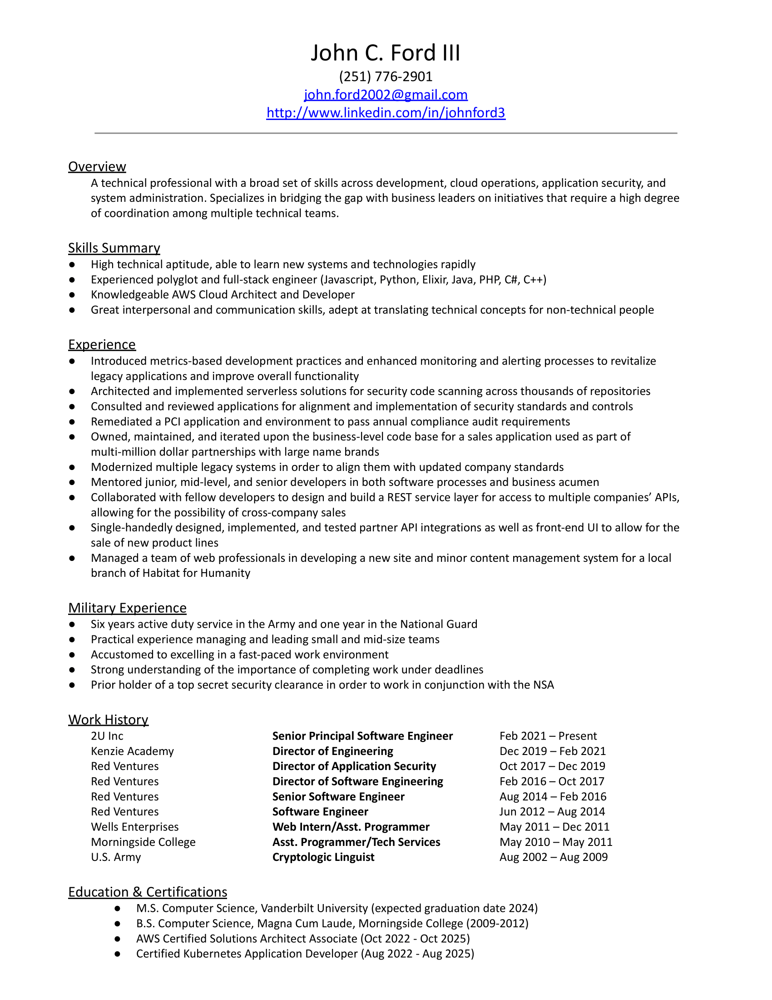

# Vanderbilt Graduate Portfolio - John C. Ford III

## **SUMMARY DATA**

### **Personal Information**

* **Name:** John Charles Ford III
* **Program:** M.S. Computer Science
* **Program Start:** Fall 2022 - Full Time
* **Graduation Date:** May 2024

### **Courses & Grades**
| Course Title                           | Semester Taken | Instructor(s)            | Grade    |
| -------------------------------------- | -------------- | ------------------------ | -------- |
| CS5253 Parallel Func. Programming      | Fall ‘23       | Douglas C. Schmidt       | A        |
| CS5254 Conc. Obj-Oriented Programming  | Summer ‘23     | Douglas C. Schmidt       | A        |
| CS5260 Artificial Intelligence         | Spring ‘23     | Ronald William Hedgecock | A        |
| CS5262 Foundations of Machine Learning | Fall ‘22       | Peng Zhang               | A        |
| CS5279 Software Eng. Project           | Spring ‘24     | Yu Sun                   | Enrolled |
| CS5288 Web System Architecture         | Summer ‘23     | Edward Klein             | A        |
| CS6381 Distributed Systems             | Spring ‘23     | Aniruddha S. Gokhale     | A        |
| CS8395 Quantum Computing               | Fall ‘22       | Charles Easttom          | A+       |
| CS8395 Digital Forensics               | Fall ‘23       | Charles Easttom          | A        |
| CS8395 Microservices                   | Spring ‘24     | Douglas C. Schmidt       | Enrolled |

### Professional Goals & Achievements

When I applied to Vanderbilt, I was bringing 10+ years of software industry experience with me. I chose Vanderbilt’s program for its diverse selection of course offerings. I wanted to broaden my exposure to other disciplines within computer science, and I also wanted to strengthen my conceptual understanding of more advanced topics. Distributed systems, concurrency, and parallelism have increasingly been featured in many of the technical challenges within my career.

### Academic Achievements

During my studies at Vanderbilt, I successfully maintained a full course load while also working full-time as a Senior Principal Software Engineer. At times, this meant spending all day on the computer for my day job and immediately switching into student-mode from the moment work finished until it was time for bed. Finishing the program is the culmination of all the hard work, and the results were worth it. I showed a high level of academic dedication and excellence, maintaining a 4.0 GPA throughout the program. 

## **CURRICULUM VITAE**

[Latest Curriculum Vitae](./curriculum-vitae.pdf)

## **KNOWLEDGE & MASTERY OF COMPUTER SCIENCE CONCEPTS**
### Artifact - Apply Computer Science Concepts

As part of Vanderbilt’s CS-5262 Foundations of Machine Learning, I was able to combine a personal interest in local real estate with newly learned skills in analyzing data and creating ML models. Prior to taking this course, I had only ever consumed the outputs of models created by teams of analysts and data scientists. Learning about the work behind creating models and evaluating them offered a lot of insights into the different challenges facing my colleagues. 
  
**[Real Estate Sales Data Exploration - Arapahoe County, Colorado (October 2022)](./real-estate-exploration.pdf)**

### Artifact - Contribute to Software Artifacts

## **COMMUNICATION SKILLS IN COMPUTER SCIENCE**
### Artifact - Demonstrate Communication Skills

As part of Vanderbilt’s CS-8395 Quantum Computing, in addition to developing a deeper understanding of quantum computing, I also wanted to get a sense of the landscape of providers for cloud quantum computing. As an IT professional, I’m often asked to survey new software and technology offerings. This project  presented a concise summary of my findings in an easy-to-read article format complete with references.
  
**[An Overview of the Cloud Quantum Computing Market (September 2022)](./cloud-quantum-computing-market.pdf)**

## **CONDUCT INDEPENDENT INQUIRY IN COMPUTER SCIENCE**
### Artifact - Conduct Independent Inquiry

As the final project for Vanderbilt’s CS-8395 Digital Forensics, I chose to explore capabilities for conducting forensics investigations within a kubernetes cluster. While my academic and professional projects have often involved interacting with kubernetes, I have had little opportunity to work on the initialization, maintenance, and security aspects of a cluster. This project was a perfect alignment of goals, learn more about kubernetes and understand how forensics tooling adapts to new developments in distributed computing environments. 
  
**[Kubernetes Forensics (December 2023)](./kubernetes-forensics.pdf)**